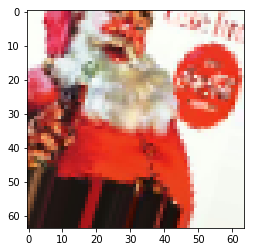
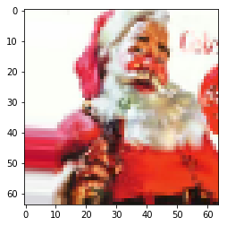
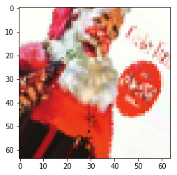

# Convolutional Neural Networks - Codealong

## Introduction

In this code-along, we will reinvestigate our previous Santa image classification example. To do this, we will review loading a dataset from a nested directory structure and building a baseline model. From there, we'll demonstrate building a CNN and demonstrate its improved performance on image recognition tasks. You are recommended to run the cells in order to further explore variables and investigate the code snippets themselves. However, please note that some cells (particularly training cells later on) may take some time to run. [On a Macbook pro the entire notebook took ~15 minutes to run.]

## Objectives  

You will be able to:
* Load data from a hierarchical directory structure
* Build a CNN for image recognition tasks

## Properly store your images

When you're analyzing your image data, file management is important. We will be using the santa images again, but this time, they are just stored in two folders: `santa` and `not_santa`, under. We want to work with a `train`, `validation` and `test` data set now, as we know by now that this is the best way to go. 

Let's import libraries `os` and `shutil`, as we'll need them to create the new folders and move the new files in there.


```python
import os, shutil
```

Create three objects representing the existing directories 'data/santa/' as `data_santa_dir` and 'data/not_santa/' as `data_not_santa_dir`. We will create a new directory 'split/' as `new_dir`, where we will split the data set in three groups (or three subdirectories) 'train', 'test' and 'validation', each containing `santa` and `not_santa` subfolders. The final desired structure is represented below:


```python
data_santa_dir = 'data/santa/'
data_not_santa_dir = 'data/not_santa/'
new_dir = 'split/'
```

You can use `os.listdir()` to create an object that stores all the relevant image names. 


```python
imgs_santa = [file for file in os.listdir(data_santa_dir) if file.endswith('.jpg')]
```


```python
imgs_santa[0:10]
```


    ['00000000.jpg',
     '00000001.jpg',
     '00000003.jpg',
     '00000004.jpg',
     '00000005.jpg',
     '00000006.jpg',
     '00000007.jpg',
     '00000008.jpg',
     '00000009.jpg',
     '00000010.jpg']


Let's see how many images there are in the 'santa' directory.


```python
print('There are',len(imgs_santa), 'santa images')
```

    There are 461 santa images
    

Now, repeat this for the 'not_santa' directory


```python
imgs_not_santa = [file for file in os.listdir(data_not_santa_dir) if file.endswith('.jpg')]
```


```python
print('There are', len(imgs_not_santa), 'images without santa')
```

    There are 461 images without santa
    

Create all the folders and subfolder in order to get the structure represented above. You can use `os.path.join` to create strings that will be used later on to generate new directories.


```python
os.mkdir(new_dir)
```


```python
train_folder = os.path.join(new_dir, 'train')
train_santa = os.path.join(train_folder, 'santa')
train_not_santa = os.path.join(train_folder, 'not_santa')

test_folder = os.path.join(new_dir, 'test')
test_santa = os.path.join(test_folder, 'santa')
test_not_santa = os.path.join(test_folder, 'not_santa')

val_folder = os.path.join(new_dir, 'validation')
val_santa = os.path.join(val_folder, 'santa')
val_not_santa = os.path.join(val_folder, 'not_santa')
```


```python
train_santa
```


    'split/train\\santa'


Now use all the path strings you created to make new directories. You can use `os.mkdir()` to do this. Go have a look at your directory and see if this worked!


```python
os.mkdir(test_folder)
os.mkdir(test_santa)
os.mkdir(test_not_santa)

os.mkdir(train_folder)
os.mkdir(train_santa)
os.mkdir(train_not_santa)

os.mkdir(val_folder)
os.mkdir(val_santa)
os.mkdir(val_not_santa)
```

Copy the Santa images in the three santa subfolders. Let's put the first 271 images in the training set, the next 100 images in the validation set and the final 90 images in the test set.


```python
# train santa
imgs = imgs_santa[:271]
for img in imgs:
    origin = os.path.join(data_santa_dir, img)
    destination = os.path.join(train_santa, img)
    shutil.copyfile(origin, destination)
```


```python
# validation santa
imgs = imgs_santa[271:371]
for img in imgs:
    origin = os.path.join(data_santa_dir, img)
    destination = os.path.join(val_santa, img)
    shutil.copyfile(origin, destination)
```


```python
# test santa
imgs = imgs_santa[371:]
for img in imgs:
    origin = os.path.join(data_santa_dir, img)
    destination = os.path.join(test_santa, img)
    shutil.copyfile(origin, destination)
```

Now, repeat all this for the 'not_santa' images!


```python
# train not_santa
imgs = imgs_not_santa[:271]
for img in imgs:
    origin = os.path.join(data_not_santa_dir, img)
    destination = os.path.join(train_not_santa, img)
    shutil.copyfile(origin, destination)
# validation not_santa
imgs = imgs_not_santa[271:371]
for img in imgs:
    origin = os.path.join(data_not_santa_dir, img)
    destination = os.path.join(val_not_santa, img)
    shutil.copyfile(origin, destination)
# test not_santa
imgs = imgs_not_santa[371:]
for img in imgs:
    origin = os.path.join(data_not_santa_dir, img)
    destination = os.path.join(test_not_santa, img)
    shutil.copyfile(origin, destination)
```

Let's print out how many images we have in each directory so we know for sure our numbers are right!


```python
print('There are', len(os.listdir(train_santa)), 'santa images in the training set')
```

    There are 271 santa images in the training set
    


```python
print('There are', len(os.listdir(val_santa)), 'santa images in the validation set')
```

    There are 100 santa images in the validation set
    


```python
print('There are', len(os.listdir(test_santa)), 'santa images in the test set')
```

    There are 90 santa images in the test set
    


```python
print('There are', len(os.listdir(train_not_santa)), 'images without santa in the train set')
```

    There are 271 images without santa in the train set
    


```python
print('There are', len(os.listdir(val_not_santa)), 'images without santa in the validation set')
```

    There are 100 images without santa in the validation set
    


```python
print('There are', len(os.listdir(test_not_santa)), 'images without santa in the test set')
```

    There are 90 images without santa in the test set
    

## Use a densely connected network as a baseline

Now that we've sorted our data, we can easily use Keras' module with image-processing tools. Let's import the necessary libraries below. 


```python
import time
import matplotlib.pyplot as plt
import scipy
import numpy as np
from PIL import Image
from scipy import ndimage
from keras.preprocessing.image import ImageDataGenerator, array_to_img, img_to_array, load_img

np.random.seed(123)
```

    Using TensorFlow backend.
    


```python
# get all the data in the directory split/test (180 images), and reshape them
test_generator = ImageDataGenerator(rescale=1./255).flow_from_directory(
        test_folder, 
        target_size=(64, 64), batch_size = 180) 

# get all the data in the directory split/validation (200 images), and reshape them
val_generator = ImageDataGenerator(rescale=1./255).flow_from_directory(
        val_folder, 
        target_size=(64, 64), batch_size = 200)

# get all the data in the directory split/train (542 images), and reshape them
train_generator = ImageDataGenerator(rescale=1./255).flow_from_directory(
        train_folder, 
        target_size=(64, 64), batch_size=542)
```

    Found 180 images belonging to 2 classes.
    Found 200 images belonging to 2 classes.
    Found 542 images belonging to 2 classes.
    


```python
# create the data sets
train_images, train_labels = next(train_generator)
test_images, test_labels = next(test_generator)
val_images, val_labels = next(val_generator)
```


```python
# Explore your dataset again
m_train = train_images.shape[0]
num_px = train_images.shape[1]
m_test = test_images.shape[0]
m_val = val_images.shape[0]

print ("Number of training samples: " + str(m_train))
print ("Number of testing samples: " + str(m_test))
print ("Number of validation samples: " + str(m_val))
print ("train_images shape: " + str(train_images.shape))
print ("train_labels shape: " + str(train_labels.shape))
print ("test_images shape: " + str(test_images.shape))
print ("test_labels shape: " + str(test_labels.shape))
print ("val_images shape: " + str(val_images.shape))
print ("val_labels shape: " + str(val_labels.shape))
```

    Number of training samples: 542
    Number of testing samples: 180
    Number of validation samples: 200
    train_images shape: (542, 64, 64, 3)
    train_labels shape: (542, 2)
    test_images shape: (180, 64, 64, 3)
    test_labels shape: (180, 2)
    val_images shape: (200, 64, 64, 3)
    val_labels shape: (200, 2)
    


```python
train_img = train_images.reshape(train_images.shape[0], -1)
test_img = test_images.reshape(test_images.shape[0], -1)
val_img = val_images.reshape(val_images.shape[0], -1)

print(train_img.shape)
print(test_img.shape)
print(val_img.shape)
```

    (542, 12288)
    (180, 12288)
    (200, 12288)
    


```python
train_y = np.reshape(train_labels[:,0], (542,1))
test_y = np.reshape(test_labels[:,0], (180,1))
val_y = np.reshape(val_labels[:,0], (200,1))
```


```python
from keras import models
from keras import layers
np.random.seed(123)
model = models.Sequential()
model.add(layers.Dense(20, activation='relu', input_shape=(12288,))) #2 hidden layers
model.add(layers.Dense(7, activation='relu'))
model.add(layers.Dense(5, activation='relu'))
model.add(layers.Dense(1, activation='sigmoid'))
```


```python
model.compile(optimizer='sgd',
              loss='binary_crossentropy',
              metrics=['accuracy'])

histoire = model.fit(train_img,
                    train_y,
                    epochs=50,
                    batch_size=32,
                    validation_data=(val_img, val_y))
```

    Train on 542 samples, validate on 200 samples
    Epoch 1/50
    542/542 [==============================] - 0s 611us/step - loss: 0.6979 - acc: 0.4963 - val_loss: 0.6647 - val_acc: 0.5000
    Epoch 2/50
    542/542 [==============================] - 0s 242us/step - loss: 0.6760 - acc: 0.5535 - val_loss: 0.6526 - val_acc: 0.5000
    Epoch 3/50
    542/542 [==============================] - 0s 234us/step - loss: 0.6710 - acc: 0.5701 - val_loss: 0.6356 - val_acc: 0.6000
    Epoch 4/50
    542/542 [==============================] - 0s 232us/step - loss: 0.6375 - acc: 0.6476 - val_loss: 0.6282 - val_acc: 0.5150
    Epoch 5/50
    542/542 [==============================] - 0s 229us/step - loss: 0.6179 - acc: 0.6605 - val_loss: 0.6180 - val_acc: 0.5300
    Epoch 6/50
    542/542 [==============================] - 0s 258us/step - loss: 0.6248 - acc: 0.6255 - val_loss: 0.5953 - val_acc: 0.5950
    Epoch 7/50
    542/542 [==============================] - 0s 238us/step - loss: 0.5784 - acc: 0.7232 - val_loss: 0.5587 - val_acc: 0.7050
    Epoch 8/50
    542/542 [==============================] - 0s 238us/step - loss: 0.5883 - acc: 0.6956 - val_loss: 0.6822 - val_acc: 0.5950
    Epoch 9/50
    542/542 [==============================] - 0s 225us/step - loss: 0.5519 - acc: 0.7232 - val_loss: 0.5208 - val_acc: 0.7750
    Epoch 10/50
    542/542 [==============================] - 0s 220us/step - loss: 0.5873 - acc: 0.7011 - val_loss: 0.6818 - val_acc: 0.6600
    Epoch 11/50
    542/542 [==============================] - 0s 229us/step - loss: 0.5546 - acc: 0.7269 - val_loss: 0.5137 - val_acc: 0.7650
    Epoch 12/50
    542/542 [==============================] - 0s 240us/step - loss: 0.5846 - acc: 0.7454 - val_loss: 0.5023 - val_acc: 0.7750
    Epoch 13/50
    542/542 [==============================] - 0s 231us/step - loss: 0.5297 - acc: 0.7509 - val_loss: 0.5104 - val_acc: 0.7550
    Epoch 14/50
    542/542 [==============================] - 0s 238us/step - loss: 0.5201 - acc: 0.7399 - val_loss: 0.5074 - val_acc: 0.7950
    Epoch 15/50
    542/542 [==============================] - 0s 253us/step - loss: 0.5315 - acc: 0.7288 - val_loss: 0.6205 - val_acc: 0.6700
    Epoch 16/50
    542/542 [==============================] - 0s 255us/step - loss: 0.4472 - acc: 0.8081 - val_loss: 1.1585 - val_acc: 0.5100
    Epoch 17/50
    542/542 [==============================] - 0s 253us/step - loss: 0.4266 - acc: 0.8192 - val_loss: 0.6532 - val_acc: 0.6100
    Epoch 18/50
    542/542 [==============================] - 0s 282us/step - loss: 0.5210 - acc: 0.7694 - val_loss: 0.5052 - val_acc: 0.7800
    Epoch 19/50
    542/542 [==============================] - 0s 247us/step - loss: 0.4005 - acc: 0.8229 - val_loss: 0.4590 - val_acc: 0.8150
    Epoch 20/50
    542/542 [==============================] - 0s 260us/step - loss: 0.4324 - acc: 0.8063 - val_loss: 0.5526 - val_acc: 0.7200
    Epoch 21/50
    542/542 [==============================] - 0s 251us/step - loss: 0.4001 - acc: 0.8339 - val_loss: 0.5380 - val_acc: 0.6600
    Epoch 22/50
    542/542 [==============================] - 0s 251us/step - loss: 0.3486 - acc: 0.8561 - val_loss: 0.4992 - val_acc: 0.7650
    Epoch 23/50
    542/542 [==============================] - 0s 264us/step - loss: 0.4414 - acc: 0.7860 - val_loss: 0.4318 - val_acc: 0.8150
    Epoch 24/50
    542/542 [==============================] - 0s 231us/step - loss: 0.4043 - acc: 0.8063 - val_loss: 0.4584 - val_acc: 0.8250
    Epoch 25/50
    542/542 [==============================] - 0s 242us/step - loss: 0.3590 - acc: 0.8487 - val_loss: 0.4859 - val_acc: 0.7150
    Epoch 26/50
    542/542 [==============================] - 0s 242us/step - loss: 0.3971 - acc: 0.8432 - val_loss: 0.4567 - val_acc: 0.7900
    Epoch 27/50
    542/542 [==============================] - 0s 268us/step - loss: 0.3318 - acc: 0.8506 - val_loss: 0.4707 - val_acc: 0.8100
    Epoch 28/50
    542/542 [==============================] - 0s 245us/step - loss: 0.3027 - acc: 0.8745 - val_loss: 0.4953 - val_acc: 0.7750
    Epoch 29/50
    542/542 [==============================] - 0s 269us/step - loss: 0.3405 - acc: 0.8413 - val_loss: 0.5974 - val_acc: 0.7350
    Epoch 30/50
    542/542 [==============================] - 0s 253us/step - loss: 0.2570 - acc: 0.9022 - val_loss: 0.4237 - val_acc: 0.8150
    Epoch 31/50
    542/542 [==============================] - 0s 245us/step - loss: 0.2779 - acc: 0.8893 - val_loss: 1.0549 - val_acc: 0.5200
    Epoch 32/50
    542/542 [==============================] - 0s 249us/step - loss: 0.3126 - acc: 0.8727 - val_loss: 0.4451 - val_acc: 0.8100
    Epoch 33/50
    542/542 [==============================] - 0s 238us/step - loss: 0.2900 - acc: 0.8930 - val_loss: 0.4245 - val_acc: 0.8300
    Epoch 34/50
    542/542 [==============================] - 0s 255us/step - loss: 0.3027 - acc: 0.8708 - val_loss: 0.4696 - val_acc: 0.7700
    Epoch 35/50
    542/542 [==============================] - 0s 231us/step - loss: 0.2654 - acc: 0.9004 - val_loss: 0.7204 - val_acc: 0.7200
    Epoch 36/50
    542/542 [==============================] - 0s 251us/step - loss: 0.3012 - acc: 0.8727 - val_loss: 0.4306 - val_acc: 0.8350
    Epoch 37/50
    542/542 [==============================] - 0s 244us/step - loss: 0.3912 - acc: 0.8339 - val_loss: 0.4975 - val_acc: 0.7550
    Epoch 38/50
    542/542 [==============================] - 0s 221us/step - loss: 0.2587 - acc: 0.9354 - val_loss: 0.6033 - val_acc: 0.6550
    Epoch 39/50
    542/542 [==============================] - 0s 225us/step - loss: 0.2397 - acc: 0.9096 - val_loss: 0.4934 - val_acc: 0.8150
    Epoch 40/50
    542/542 [==============================] - 0s 231us/step - loss: 0.2376 - acc: 0.8985 - val_loss: 0.5042 - val_acc: 0.8050
    Epoch 41/50
    542/542 [==============================] - 0s 225us/step - loss: 0.2486 - acc: 0.8930 - val_loss: 0.4318 - val_acc: 0.8250
    Epoch 42/50
    542/542 [==============================] - 0s 238us/step - loss: 0.1746 - acc: 0.9391 - val_loss: 0.4249 - val_acc: 0.8350
    Epoch 43/50
    542/542 [==============================] - 0s 238us/step - loss: 0.1259 - acc: 0.9613 - val_loss: 0.6474 - val_acc: 0.7650
    Epoch 44/50
    542/542 [==============================] - 0s 229us/step - loss: 0.2793 - acc: 0.8856 - val_loss: 0.5328 - val_acc: 0.7350
    Epoch 45/50
    542/542 [==============================] - 0s 223us/step - loss: 0.2924 - acc: 0.8930 - val_loss: 0.4168 - val_acc: 0.8550
    Epoch 46/50
    542/542 [==============================] - 0s 231us/step - loss: 0.1947 - acc: 0.9225 - val_loss: 0.4408 - val_acc: 0.8600
    Epoch 47/50
    542/542 [==============================] - 0s 236us/step - loss: 0.1159 - acc: 0.9779 - val_loss: 0.4700 - val_acc: 0.8050
    Epoch 48/50
    542/542 [==============================] - 0s 232us/step - loss: 0.1849 - acc: 0.9317 - val_loss: 0.4841 - val_acc: 0.8250
    Epoch 49/50
    542/542 [==============================] - 0s 258us/step - loss: 0.1917 - acc: 0.9299 - val_loss: 0.4293 - val_acc: 0.8350
    Epoch 50/50
    542/542 [==============================] - 0s 256us/step - loss: 0.1092 - acc: 0.9668 - val_loss: 0.4638 - val_acc: 0.8450
    


```python
results_train = model.evaluate(train_img, train_y)
```

    542/542 [==============================] - 0s 125us/step
    


```python
results_test = model.evaluate(test_img, test_y)
```

    180/180 [==============================] - 0s 122us/step
    


```python
results_train
```


    [0.07801556458002527, 0.9833948341682828]


```python
results_test
```


    [0.5563605096605089, 0.7777777751286824]


Remember that, in our previous lab on building deeper neural networks from scratch, we obtained a training accuracy of 95%, and a test set accuracy of 74.23%.

This result is similar to what we got building our manual "deeper" dense model. The results are not entirely different. This is not a surprise!
- Before, we only had a training and a validation set (which was at the same time the test set). Now we have split up the data 3-ways.
- We didn't use minibatches before, yet we used mini-batches of 32 units here.


## Convnet


```python
model = models.Sequential()
model.add(layers.Conv2D(32, (3, 3), activation='relu',
                        input_shape=(64 ,64,  3)))
model.add(layers.MaxPooling2D((2, 2)))

model.add(layers.Conv2D(32, (4, 4), activation='relu'))
model.add(layers.MaxPooling2D((2, 2)))

model.add(layers.Conv2D(64, (3, 3), activation='relu'))
model.add(layers.MaxPooling2D((2, 2)))

model.add(layers.Flatten())
model.add(layers.Dense(64, activation='relu'))
model.add(layers.Dense(1, activation='sigmoid'))

model.compile(loss='binary_crossentropy',
              optimizer="sgd",
              metrics=['acc'])
```


```python
history = model.fit(train_images,
                    train_y,
                    epochs=30,
                    batch_size=32,
                    validation_data=(val_images, val_y))
```

    Train on 542 samples, validate on 200 samples
    Epoch 1/30
    542/542 [==============================] - 3s 6ms/step - loss: 0.6828 - acc: 0.5129 - val_loss: 0.6729 - val_acc: 0.5000
    Epoch 2/30
    542/542 [==============================] - 3s 5ms/step - loss: 0.6737 - acc: 0.5018 - val_loss: 0.6659 - val_acc: 0.5000
    Epoch 3/30
    542/542 [==============================] - 3s 5ms/step - loss: 0.6667 - acc: 0.5000 - val_loss: 0.6572 - val_acc: 0.5000
    Epoch 4/30
    542/542 [==============================] - 3s 6ms/step - loss: 0.6592 - acc: 0.5129 - val_loss: 0.6484 - val_acc: 0.5050
    Epoch 5/30
    542/542 [==============================] - 3s 5ms/step - loss: 0.6481 - acc: 0.5369 - val_loss: 0.6377 - val_acc: 0.5650
    Epoch 6/30
    542/542 [==============================] - 3s 5ms/step - loss: 0.6365 - acc: 0.6236 - val_loss: 0.6214 - val_acc: 0.6000
    Epoch 7/30
    542/542 [==============================] - 3s 5ms/step - loss: 0.6211 - acc: 0.6716 - val_loss: 0.6020 - val_acc: 0.6150
    Epoch 8/30
    542/542 [==============================] - 3s 5ms/step - loss: 0.6013 - acc: 0.6993 - val_loss: 0.5878 - val_acc: 0.8700
    Epoch 9/30
    542/542 [==============================] - 3s 6ms/step - loss: 0.5794 - acc: 0.7952 - val_loss: 0.5548 - val_acc: 0.6850
    Epoch 10/30
    542/542 [==============================] - 3s 6ms/step - loss: 0.5586 - acc: 0.7786 - val_loss: 0.5437 - val_acc: 0.6400
    Epoch 11/30
    542/542 [==============================] - 3s 5ms/step - loss: 0.5390 - acc: 0.7786 - val_loss: 0.4964 - val_acc: 0.7750
    Epoch 12/30
    542/542 [==============================] - 3s 5ms/step - loss: 0.5228 - acc: 0.7749 - val_loss: 0.4600 - val_acc: 0.9150
    Epoch 13/30
    542/542 [==============================] - 3s 6ms/step - loss: 0.4984 - acc: 0.7952 - val_loss: 0.4276 - val_acc: 0.9150
    Epoch 14/30
    542/542 [==============================] - 3s 6ms/step - loss: 0.5049 - acc: 0.7970 - val_loss: 0.4100 - val_acc: 0.9150
    Epoch 15/30
    542/542 [==============================] - 3s 5ms/step - loss: 0.4729 - acc: 0.8081 - val_loss: 0.5008 - val_acc: 0.7100
    Epoch 16/30
    542/542 [==============================] - 3s 5ms/step - loss: 0.4432 - acc: 0.8376 - val_loss: 0.4363 - val_acc: 0.8150
    Epoch 17/30
    542/542 [==============================] - 3s 5ms/step - loss: 0.4482 - acc: 0.7970 - val_loss: 0.3425 - val_acc: 0.9300
    Epoch 18/30
    542/542 [==============================] - 3s 5ms/step - loss: 0.3451 - acc: 0.8948 - val_loss: 0.5443 - val_acc: 0.6950
    Epoch 19/30
    542/542 [==============================] - 3s 5ms/step - loss: 0.3888 - acc: 0.8432 - val_loss: 0.4620 - val_acc: 0.7400
    Epoch 20/30
    542/542 [==============================] - 3s 5ms/step - loss: 0.4442 - acc: 0.7841 - val_loss: 0.3405 - val_acc: 0.8900
    Epoch 21/30
    542/542 [==============================] - 3s 5ms/step - loss: 0.3251 - acc: 0.8948 - val_loss: 0.2742 - val_acc: 0.9400
    Epoch 22/30
    542/542 [==============================] - 3s 5ms/step - loss: 0.3628 - acc: 0.8450 - val_loss: 0.2851 - val_acc: 0.9400
    Epoch 23/30
    542/542 [==============================] - 3s 5ms/step - loss: 0.2784 - acc: 0.9059 - val_loss: 0.3714 - val_acc: 0.8450
    Epoch 24/30
    542/542 [==============================] - 3s 5ms/step - loss: 0.3133 - acc: 0.8819 - val_loss: 0.2587 - val_acc: 0.9400
    Epoch 25/30
    542/542 [==============================] - 3s 5ms/step - loss: 0.2948 - acc: 0.8838 - val_loss: 0.2563 - val_acc: 0.9400
    Epoch 26/30
    542/542 [==============================] - 3s 5ms/step - loss: 0.2393 - acc: 0.9133 - val_loss: 0.3759 - val_acc: 0.8450
    Epoch 27/30
    542/542 [==============================] - 3s 5ms/step - loss: 0.3182 - acc: 0.8690 - val_loss: 0.2843 - val_acc: 0.8700
    Epoch 28/30
    542/542 [==============================] - 3s 5ms/step - loss: 0.2537 - acc: 0.9077 - val_loss: 0.2438 - val_acc: 0.9400
    Epoch 29/30
    542/542 [==============================] - 3s 5ms/step - loss: 0.3387 - acc: 0.8708 - val_loss: 0.2336 - val_acc: 0.9400
    Epoch 30/30
    542/542 [==============================] - 3s 5ms/step - loss: 0.2185 - acc: 0.9373 - val_loss: 0.2930 - val_acc: 0.9200
    


```python
results_train = model.evaluate(train_images, train_y)
```

    542/542 [==============================] - 1s 2ms/step
    


```python
results_test = model.evaluate(test_images, test_y)
```

    180/180 [==============================] - 0s 2ms/step
    


```python
results_train
```


    [0.2525194299946852, 0.9188191866522786]


```python
results_test
```


    [0.33800292478667365, 0.8833333359824287]


## Data Augmentation

ImageDataGenerator becomes really useful when we *actually* want to generate more data. We'll show you how this works.


```python
train_datagen= ImageDataGenerator(rescale=1./255, 
     rotation_range=40,
     width_shift_range=0.2,
     height_shift_range=0.2,
     shear_range=0.3,
     zoom_range=0.1,
     horizontal_flip = False)
```


```python
names = [os.path.join(train_santa, name) for name in os.listdir(train_santa)]
img_path = names[91]
img = load_img(img_path, target_size=(64, 64))

reshape_img = img_to_array(img) 
reshape_img = reshape_img.reshape((1,) + reshape_img.shape) 
i=0
for batch in train_datagen.flow(reshape_img, batch_size=1):
    plt.figure(i)
    imgplot = plt.imshow(array_to_img(batch[0]))
    i += 1
    if i % 3 == 0:
        break
plt.show()
```











```python
# get all the data in the directory split/test (180 images), and reshape them
test_generator = ImageDataGenerator(rescale=1./255).flow_from_directory(
        test_folder, 
        target_size=(64, 64), 
        batch_size = 180,
        class_mode='binary') 

# get all the data in the directory split/validation (200 images), and reshape them
val_generator = ImageDataGenerator(rescale=1./255).flow_from_directory(
        val_folder, 
        target_size=(64, 64),
        batch_size = 32,
        class_mode='binary')

# get all the data in the directory split/train (542 images), and reshape them
train_generator = train_datagen.flow_from_directory(
        train_folder, 
        target_size=(64, 64), 
        batch_size = 32, 
        class_mode='binary')
```

    Found 180 images belonging to 2 classes.
    Found 200 images belonging to 2 classes.
    Found 542 images belonging to 2 classes.
    


```python
model = models.Sequential()
model.add(layers.Conv2D(32, (3, 3), activation='relu',
                        input_shape=(64 ,64,  3)))
model.add(layers.MaxPooling2D((2, 2)))

model.add(layers.Conv2D(32, (4, 4), activation='relu'))
model.add(layers.MaxPooling2D((2, 2)))

model.add(layers.Conv2D(64, (3, 3), activation='relu'))
model.add(layers.MaxPooling2D((2, 2)))

model.add(layers.Flatten())
model.add(layers.Dense(64, activation='relu'))
model.add(layers.Dense(1, activation='sigmoid'))

model.compile(loss='binary_crossentropy',
              optimizer= 'sgd',
              metrics=['acc'])
```


```python
history_2 = model.fit_generator(
      train_generator,
      steps_per_epoch=25,
      epochs=30,
      validation_data=val_generator,
      validation_steps=25)
```

    Epoch 1/30
    25/25 [==============================] - 22s 874ms/step - loss: 0.6853 - acc: 0.5026 - val_loss: 0.6759 - val_acc: 0.5000
    Epoch 2/30
    25/25 [==============================] - 17s 673ms/step - loss: 0.6804 - acc: 0.4949 - val_loss: 0.6696 - val_acc: 0.5000
    Epoch 3/30
    25/25 [==============================] - 17s 669ms/step - loss: 0.6728 - acc: 0.5053 - val_loss: 0.6610 - val_acc: 0.5000
    Epoch 4/30
    25/25 [==============================] - 17s 683ms/step - loss: 0.6673 - acc: 0.5037 - val_loss: 0.6524 - val_acc: 0.5000
    Epoch 5/30
    25/25 [==============================] - 17s 665ms/step - loss: 0.6615 - acc: 0.5100 - val_loss: 0.6431 - val_acc: 0.5200
    Epoch 6/30
    25/25 [==============================] - 17s 667ms/step - loss: 0.6485 - acc: 0.5373 - val_loss: 0.6333 - val_acc: 0.7100
    Epoch 7/30
    25/25 [==============================] - 17s 690ms/step - loss: 0.6335 - acc: 0.5878 - val_loss: 0.6102 - val_acc: 0.5300
    Epoch 8/30
    25/25 [==============================] - 16s 631ms/step - loss: 0.6150 - acc: 0.6689 - val_loss: 0.5861 - val_acc: 0.5800
    Epoch 9/30
    25/25 [==============================] - 17s 671ms/step - loss: 0.5953 - acc: 0.7554 - val_loss: 0.5521 - val_acc: 0.8500
    Epoch 10/30
    25/25 [==============================] - 18s 710ms/step - loss: 0.5595 - acc: 0.8060 - val_loss: 0.5224 - val_acc: 0.9100
    Epoch 11/30
    25/25 [==============================] - 16s 655ms/step - loss: 0.5280 - acc: 0.8201 - val_loss: 0.4577 - val_acc: 0.8850
    Epoch 12/30
    25/25 [==============================] - 18s 728ms/step - loss: 0.5019 - acc: 0.7936 - val_loss: 0.4624 - val_acc: 0.7950
    Epoch 13/30
    25/25 [==============================] - 16s 623ms/step - loss: 0.4475 - acc: 0.8422 - val_loss: 0.3777 - val_acc: 0.8800
    Epoch 14/30
    25/25 [==============================] - 16s 651ms/step - loss: 0.4143 - acc: 0.8427 - val_loss: 0.5949 - val_acc: 0.6050
    Epoch 15/30
    25/25 [==============================] - 17s 683ms/step - loss: 0.3839 - acc: 0.8491 - val_loss: 0.4054 - val_acc: 0.8350
    Epoch 16/30
    25/25 [==============================] - 17s 681ms/step - loss: 0.4249 - acc: 0.8053 - val_loss: 0.2907 - val_acc: 0.9150
    Epoch 17/30
    25/25 [==============================] - 17s 675ms/step - loss: 0.3717 - acc: 0.8543 - val_loss: 0.4121 - val_acc: 0.8150
    Epoch 18/30
    25/25 [==============================] - 17s 679ms/step - loss: 0.3445 - acc: 0.8616 - val_loss: 0.3222 - val_acc: 0.9000
    Epoch 19/30
    25/25 [==============================] - 16s 652ms/step - loss: 0.3036 - acc: 0.8873 - val_loss: 0.2728 - val_acc: 0.9250
    Epoch 20/30
    25/25 [==============================] - 16s 653ms/step - loss: 0.3041 - acc: 0.8647 - val_loss: 0.3069 - val_acc: 0.9100
    Epoch 21/30
    25/25 [==============================] - 17s 698ms/step - loss: 0.2796 - acc: 0.8871 - val_loss: 0.2802 - val_acc: 0.9250
    Epoch 22/30
    25/25 [==============================] - 16s 638ms/step - loss: 0.2445 - acc: 0.9048 - val_loss: 0.2198 - val_acc: 0.9450
    Epoch 23/30
    25/25 [==============================] - 18s 720ms/step - loss: 0.2878 - acc: 0.8907 - val_loss: 0.2344 - val_acc: 0.9300
    Epoch 24/30
    25/25 [==============================] - 16s 644ms/step - loss: 0.2933 - acc: 0.8760 - val_loss: 0.3048 - val_acc: 0.9200
    Epoch 25/30
    25/25 [==============================] - 18s 711ms/step - loss: 0.2292 - acc: 0.9143 - val_loss: 0.2329 - val_acc: 0.9300
    Epoch 26/30
    25/25 [==============================] - 17s 688ms/step - loss: 0.2418 - acc: 0.9086 - val_loss: 0.3192 - val_acc: 0.9050
    Epoch 27/30
    25/25 [==============================] - 16s 647ms/step - loss: 0.2534 - acc: 0.8957 - val_loss: 0.3115 - val_acc: 0.9250
    Epoch 28/30
    25/25 [==============================] - 19s 780ms/step - loss: 0.2085 - acc: 0.9211 - val_loss: 0.2016 - val_acc: 0.9500
    Epoch 29/30
    25/25 [==============================] - 15s 614ms/step - loss: 0.2310 - acc: 0.9028 - val_loss: 0.2346 - val_acc: 0.9300
    Epoch 30/30
    25/25 [==============================] - 19s 773ms/step - loss: 0.2452 - acc: 0.8922 - val_loss: 0.3579 - val_acc: 0.9050
    


```python
test_x, test_y = next(test_generator)
```


```python
results_test = model.evaluate(test_x, test_y)
```

    180/180 [==============================] - 0s 2ms/step
    


```python
results_test
```


    [0.40759514570236205, 0.8444444431198967]


## Summary  

In this code along lab, we looked again at some of the preprocessing techniques needed in order to organize our data prior to building a model using Keras. Afterwards, we investigated new code in order to build a CNN for image recognition.
